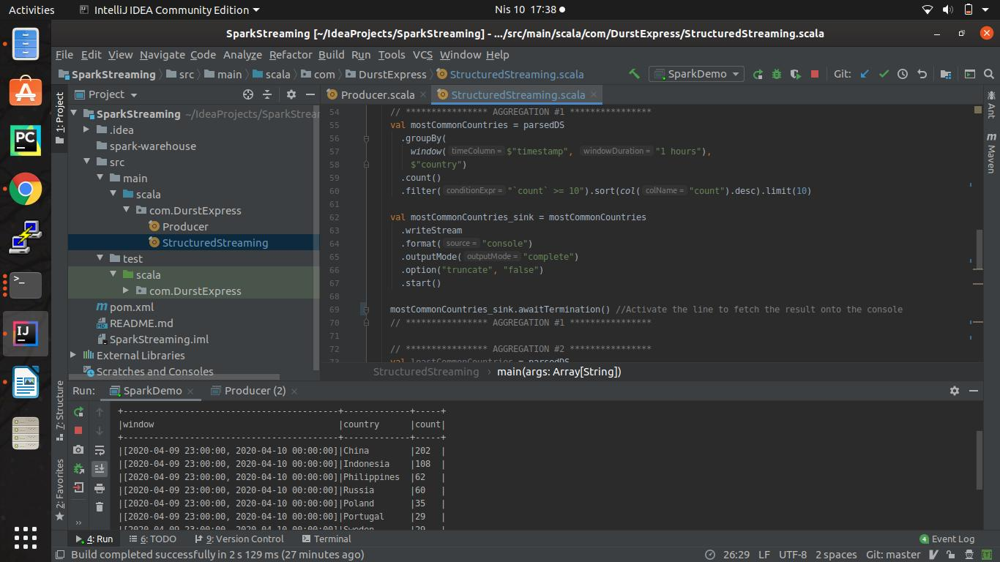

--- HOW TO USE ---

 - SOFTWARE VERSIONS -
OS        = Ubuntu 19.10 
JAVA      = 1.8.0_242 
KAFKA     = 2.1.1 
SPARK     = 2.4.5 
INTELLIJ  = 2019.3.4 (Community Edition) 
MAVEN     = 3.6.1 
*** SOFTWARE VERSIONS ***

1.Java Installation 
      sudo apt-get update sudo apt install openjdk-8-jdk

2. Kafka Instalation 
      mkdir kafka 
      wget "https://www.apache.org/dist/kafka/2.1.1/kafka_2.11-2.1.1.tgz" -o /home/ckk/kafka/kafka.tgz 
      tar -xvzf kafka_2.11-2.1.1.tgz 
      vim ~/.bashrc 
        export KAFKA_HOME=/home/hadoop/kafka/kafka_2.11-2.1.1 
        export PATH=$PATH:$KAFKA_HOME/bin 
        source ~/.bashrc 
      cd ~/kafka_2.11-2.1.1 
      mkdir data 
      mkdir data/zookeeper 
      cd config 
      vim zookeeper.properties 
        dataDir=/home/ckk/kafka/kafka_2.11-2.1.1/data/zookeeper 
      bin/zookeeper-server-start.sh config/zookeeper.properties 
      mkdir data/kafka nano config/server.properties 
        log.dirs=/home/ckk/kafka/kafka_2.11-2.1.1/data/kafka

      #### Ideally we need to assign replication factor=3 to provide fault tolerant design. -Local Device Setting is for test purpose.
      kafka/kafka_2.11-2.1.1$ nano config/server.properties offsets.topic.replication.factor=1

3. Scala & Spark Installation 
      sudo apt-get install scala 
      sudo apt-get install scala 
      mkdir spark 
      cd spark 
      wget "https://ftp.itu.edu.tr/Mirror/Apache/spark/spark-2.4.5/spark-2.4.5-bin-hadoop2.7.tgz" 
      tar xvf spark-2.4.5-bin-hadoop2.7.tgz 
      sudo mv spark-2.4.5-bin-hadoop2.7/ /opt/spark 
      sudo vim ~/.bashrc 
        export SPARK_HOME=/opt/spark export 
         PATH=$PATH:$SPARK_HOME/bin:$SPARK_HOME/sbin source 
      ~/.bashrc

4. Clone Repository
5. Open intellij/bin directory
6. Start Intellij by ./idea.sh
7. Open cloned Project
8. Ensure Maven Configuration is done. 
     Follow instructions https://www.atozlearner.com/distributed-computing/2018/12/13/setup-apache-spark-intellij/) b. Add        Framework Support --> Scala

9. Create a Kafka Topic

#### Set segment.ms config to 1000 milliseconds to ensure a new segment is created at every second.
#### Data Retention for each partition is limited with 10GB since we can retain 100GB (Upper Boundary: 200GB)
#### Cleaner thread finds the filthiest log and cleans it if the ratio is greater than 0.1
#### retention.bytes defines how much data Kafka will ensure is available
#### retention.ms is 7 days by default, changed as 10 days.

bin/kafka-topics.sh --create --zookeeper localhost:2181 --replication-factor 1 --partitions 10
--topic Users --config "cleanup.policy=compact"
--config "segment.ms=1000"
--config "min.cleanable.dirty.ratio=0.01"
--config "retention.bytes=10737418240"
--config "retention.ms=864000000"

10. Run the StructuredStreaming Object in Scala
11. Run the Producer Object in Scala
12. Check out StructuredStreaming execution console

